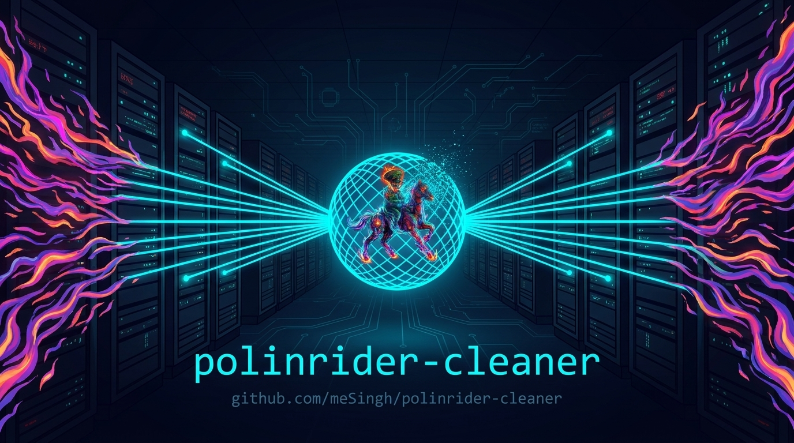
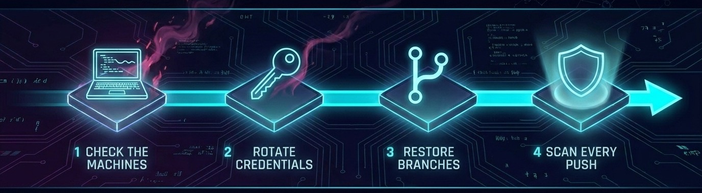

<p align="center">
  
</p>

<h1 align="center">polinrider-cleaner</h1>

<p align="center">
  Detect and clean up after the <strong>PolinRider</strong> supply-chain campaign,
  on a GitHub organization, on a personal account, or on a developer machine.
</p>

<p align="center">
  <a href="https://github.com/meSingh/polinrider-cleaner/actions/workflows/ci.yml"></a>
  <a href="https://scorecard.dev/viewer/?uri=github.com/meSingh/polinrider-cleaner"></a>
  <a href="https://github.com/meSingh/polinrider-cleaner/actions/workflows/semgrep.yml"></a>
  <a href="LICENSE"></a>
  
  
  
  <a href="AGENTS.md"></a>
  <br>
  <a href="https://github.com/meSingh/polinrider-cleaner/commits/main"></a>
  <a href="https://github.com/meSingh/polinrider-cleaner/releases/latest"></a>
</p>

<p align="center">
  <sub>Shell only. No Node, no Python, nothing to install. Every destructive step is a dry run first.</sub>
</p>

---

> [!CAUTION]
> **Mid-incident?** Two commands. It asks what you need, works out which scanner
> to run for the machine you are on, and tells you what to do next.
>
> ```bash
> git clone https://github.com/meSingh/polinrider-cleaner.git && cd polinrider-cleaner
> ./polinrider.sh
> ```
>
> Read-only. It changes nothing. Everything else on this page can wait.

---

## Which part do you need?

| Your situation | Folder | What it does |
|---|---|---|
| Branches across an organization's repos were force-pushed | [**`github-org-recovery/`**](github-org-recovery/) | Scans every repo in a GitHub **organization**, then puts each branch back where it was |
| Your own GitHub repositories were force-pushed | [**`github-account-recovery/`**](github-account-recovery/) | The same for **one personal account**, where the attacker pushed using your own login |
| Your laptop opened an infected repo, or installed a flagged package | [**`machine-cleanup/`**](machine-cleanup/) | Checks and cleans **one computer**: files, editor extensions, persistence, an installed implant. macOS, Linux, Windows |
| You want every future push and PR scanned automatically | [**`ci/`**](ci/) | A scanner you **copy into your own repo**, so every push is checked with no third-party action |

<sub>The two GitHub folders say <strong>recovery</strong> because that is what they do: they put
your branches back. Nothing is deleted and no history is rewritten. The machine folder says
<strong>cleanup</strong> because that one genuinely removes malware from a computer, by moving it
to quarantine rather than deleting it.</sub>

`./polinrider.sh` picks for you. If you would rather drive it yourself, or more
than one applies, **the order is fixed and it matters**:

<p align="center">
  
</p>

> [!WARNING]
> Cleaning the remote while an infected machine still holds a valid token puts
> you back where you started within minutes. That is not theoretical. It is the
> documented reinfection behaviour of this campaign.

> [!IMPORTANT]
> Independent open source tool, provided as is, with no warranty and no
> liability. You are responsible for being authorised to run it against whatever
> you point it at, and for any change you choose to apply.
> See [DISCLAIMER.md](DISCLAIMER.md).

---

## Run it

```bash
git clone --depth 1 --branch v1.0.7 https://github.com/meSingh/polinrider-cleaner.git
cd polinrider-cleaner
./polinrider.sh
```

That pins you to a specific published release rather than to whatever `main`
happens to be at the moment you clone.

Tags in this repository are protected: once published, a tag cannot be moved,
overwritten or deleted, by anyone, including the maintainer. So `v1.0.7` will
always be exactly the code that was reviewed and released as `v1.0.7`. If you
want to check that yourself:

```bash
git verify-tag v1.0.7
```

It is signed with GPG key `A743FEC7E4955B92`. Every commit in the repository is
signed too, and GitHub marks them Verified.

> [!NOTE]
> **There is deliberately no `curl ... | sh` one-liner.**
> Piping a downloaded script straight into a shell is exactly how this malware
> reaches machines, through a `.vscode/tasks.json` that runs `curl ... | bash`
> the moment you open a folder. A tool for cleaning that up should not ask you
> to do the same thing.

<details>
<summary>Prefer a release archive to a git clone?</summary>

<br>

Every release also ships a tarball with a checksum file and a build-provenance
attestation, on the
[releases page](https://github.com/meSingh/polinrider-cleaner/releases). The
clone above is simpler and gets you the signed tag, so it is what this page
recommends.

</details>

### What you need

| Tool | Needed by | Install |
|---|---|---|
| `git` | everything | already on a developer machine |
| `gh` (authenticated) | org and personal cleanup | `brew install gh` · [cli.github.com](https://cli.github.com) |
| `jq` | org and personal cleanup | `brew install jq` · `apt install jq` · `dnf install jq` |
| `bash` 3.2+ | macOS, Linux | already installed |
| PowerShell 5.1 | Windows local check | ships with Windows 10 and 11 |

Checking a computer needs nothing but the shell it already has. `gh` and `jq`
are only for the two GitHub workflows.

```bash
./polinrider.sh                    # ask, then scan the right thing
./polinrider.sh --machine          # just this computer
./polinrider.sh --org ACME         # just a GitHub organization
./polinrider.sh --user LOGIN       # just a personal account
./polinrider.sh --path ./some-repo # just one folder
./polinrider.sh --all --org ACME   # everything, in the order above
```

Every mode is read-only and prints the exact next command. `--yes` makes it
non-interactive for scripts and agents; `--help` lists the rest.

> [!TIP]
> Use a fresh, short-lived, fine-grained token created on a machine you trust,
> and revoke it when you are done.

---

# The four steps

## Step 1. Check the machines

**Read-only. Changes nothing.** Run this on every machine that has touched the
affected repositories, before you touch GitHub at all.

```bash
./polinrider.sh --machine --roots "$HOME/Sites $HOME/Projects"
```

It detects the operating system and runs the right check. Exit `0` clean ·
`1` review items only · `2` a confirmed indicator.

<details>
<summary>Running the per-OS script directly instead</summary>

<br>

```bash
./machine-cleanup/check-macos.sh ~/Sites ~/Projects      # macOS
./machine-cleanup/check-linux.sh ~/src ~/code            # Linux
```

```powershell
powershell -ExecutionPolicy Bypass -File .\machine-cleanup\check-windows.ps1 -Roots C:\work
```

Windows is the one case `polinrider.sh` cannot run for you, because it is a
PowerShell script; it prints this command instead.

</details>

<details>
<summary><strong>What it checks, and what <code>--apply</code> does</strong></summary>

<br>

It checks for the second-stage implant first, then IDE extensions, editor tasks
that run on folder open, build configs, fake fonts, the propagation script,
known-bad packages, persistence entries, shell startup files, git hooks, npm
configuration, live connections and your credential surface.

`--apply` **quarantines** confirmed artifacts into a timestamped directory with
a manifest and restore instructions. **Nothing is ever deleted.** Build config
files and shell startup files are never touched automatically. The payload is
appended to real files, so the script reports them and you re-clone.

Full detail: **[`machine-cleanup/README.md`](machine-cleanup/README.md)**

</details>

---

## Step 2. Rotate every credential

Assume everything reachable from the affected user account is in someone else's
hands. Do this from a machine you trust, **before** restoring any branch.

> [!IMPORTANT]
> If a crypto wallet or seed phrase was on that machine, move the funds now.
> This malware targets them specifically.

**First, the ones that grant repository write:**

- Every GitHub personal access token, classic and fine-grained
- Every SSH key **and signing key**
- **Deploy keys on every repository.** Routinely missed: `gh api /repos/OWNER/REPO/keys`
- Authorised OAuth apps and GitHub Apps
- Actions secrets and variables, at org, repo and environment level
- Self-hosted runner registration tokens; rebuild self-hosted runners from image

<details>
<summary><strong>The rest of the rotation list, and clearing cached credentials</strong></summary>

<br>

**Second, publish rights:**

- npm tokens plus 2FA reset. Check `npm token list` for tokens you did not create
- Packagist, PyPI, Go proxy, Docker Hub / GHCR, Chrome Web Store credentials

**Third, everything else the stealer could read:**

- Cloud keys: `~/.aws/credentials`, `~/.config/gcloud`, service account keys
- Every value in every `.env` on the affected machine
- Database, Redis and broker passwords
- Slack, Stripe, Twilio, SendGrid and payment gateway keys
- Vault tokens and kubeconfigs
- Browser-saved passwords, and session cookies via a forced global sign-out

**Cached git credentials survive a password change. Clear them:**

```bash
# macOS
git credential-osxkeychain erase <<< $'protocol=https\nhost=github.com'
# Windows
cmdkey /delete:git:https://github.com
# gh CLI, all platforms
gh auth logout && rm -f ~/.config/gh/hosts.yml
```

</details>

<details>
<summary><strong>Should the machine be rebuilt?</strong></summary>

<br>

Sources disagree, so here is the rule this repository uses.

- **Persistence artifact found**, meaning a launch agent, systemd unit, Run key,
  scheduled task, git hook, shell profile, an infected editor extension, or
  anything in the implant section: **rebuild**. Something is configured to run again.
- **Repository artifacts only, no persistence, and you can account for what ran**:
  quarantine, delete every local clone, rotate everything, keep scanning weekly.
  A rebuild is still safer if the machine holds production or financial access.

Either way, credential rotation is not optional. The stolen tokens work from
anywhere and do not care what you do to the laptop.

</details>

---

## Step 3. Restore the branches

History stays intact and no work is lost: the branch pointer moves back to the
commit that existed before the attack, and the malicious commits become
unreachable.

Start with the entry point. It scans and filters in one go, and stops there:

```bash
./polinrider.sh --org YOUR-ORG
```

> [!NOTE]
> **This is where `polinrider.sh` hands over, on purpose.** Everything it does is
> read-only. The commands below force-update branch refs on GitHub, which is the
> one genuinely destructive thing in this repository, so they stay explicit,
> behind their own preflight gates, and typed by a person who has read the plan.

The recovery itself:

```bash
# 1. Evidence first. Time-critical, see the warning below.
./github-org-recovery/scan.sh --org YOUR-ORG --out ./evidence --mirror-only

# 2. Who touched what, and when
./github-org-recovery/sweep.sh --org YOUR-ORG --since 2026-07-27T03:00:00Z --out ./evidence

# 3. Content scan, then drop your own detection files from the results
./github-org-recovery/scan.sh --org YOUR-ORG --out ./evidence --scan-only
./github-org-recovery/triage-filter.sh ./evidence/triage.json

# 4. Plan the restore. Dry run, changes nothing.
./github-org-recovery/restore.sh --sweep ./evidence/sweep.tsv --mirrors ./evidence \
                         --since 2026-07-27T03:00:00Z --actor ATTACKER-LOGIN

# 5. Gates, then apply
./github-org-recovery/preflight.sh --org YOUR-ORG --plan ./evidence/restore-plan.tsv --actor ATTACKER-LOGIN
./github-org-recovery/restore.sh   ... --apply
```

> [!WARNING]
> **Step 1 blocks everything after it.** Pre-attack commit SHAs come from the
> GitHub Events API, which keeps roughly the last 300 events per repository.
> Every push anyone makes moves the attacker's push closer to falling off the
> end. Once it is gone, non-destructive restore is no longer possible for that
> branch.

For a personal account the flow is the same but the threat model is not. The
hostile pushes carry *your* login, so actor filtering proves nothing there. Use
**[`github-account-recovery/`](github-account-recovery/)**.

<details>
<summary><strong>Reading the restore plan, and the second-wave trap</strong></summary>

<br>

| Status | Meaning | Restorable |
|---|---|---|
| `ok` | that push rewrote history. Definite force push | yes |
| `ok_fastforward` | commits appended without a rewrite. Read the diff first | yes, after review |
| `ok_orphaned` | the commit is unreachable from any ref, so the mirror never fetched it, but GitHub still holds it and confirmed so. **Normal. Not data loss** | yes |
| `MALICIOUS_TARGET` | the target is itself a commit pushed during the attack | no, widen `--since` |
| `SHA_GONE` | the commit returned 404. Garbage collected | no, delete and recreate |
| `NO_MIRROR` | no local mirror. Re-run the scan for that repo | no |

**The second-wave trap.** If the attacker pushed twice, the second push's
`before` value *is* the first push's malicious commit. Restoring to it would pin
your branches to malware. `restore.sh` refuses those rows outright. If you see
any, your `--since` starts too late.

Full walkthrough: **[`github-org-recovery/README.md`](github-org-recovery/README.md)**

</details>

---

## Step 4. Stop it happening again

```bash
./ci/install-workflow.sh /path/to/your/repo
```

That vendors the scanner and its indicator set into `.github/polinrider/` in
your repository, so the scan runs from code you control, with no marketplace
action fetched on every push. It commits nothing; review, then commit.

<details>
<summary><strong>Organization and machine hardening</strong></summary>

<br>

### GitHub organization

| Control | Why it matters for this specific attack |
|---|---|
| **Require signed commits**, org-wide | The single highest-value control. The propagation script amends and backdates commits; signing makes that immediately visible |
| Block force pushes and restrict deletions on **every** repo, no exceptions | One whitelisted "unimportant" repo is how an org gets in through the side door |
| Require PR review, dismiss stale approvals | Nothing reaches a default branch unseen |
| CODEOWNERS on `.vscode/`, `*.config.*`, `package.json`, lockfiles, `.github/workflows/` | The exact paths this malware writes to |
| Secret scanning and push protection, including a historical scan | Finds secrets the malware may have committed |
| Short-lived fine-grained PATs only; OIDC federation for cloud CI | Removes the long-lived tokens the stealer looks for |

### Developer machine

```jsonc
// VS Code user settings.json
{
  "task.allowAutomaticTasks": "off",           // kills the folderOpen vector outright
  "security.workspace.trust.enabled": true,
  "security.workspace.trust.startupPrompt": "always",
  "terminal.integrated.allowWorkspaceConfiguration": false,
  "extensions.autoUpdate": false,
  "extensions.autoCheckUpdates": false
}
```

```bash
npm config set ignore-scripts true    # then allow per project where a build needs it
```

Pin exact dependency versions, commit lockfiles, use `npm ci --ignore-scripts`
in CI, and proxy your registry if you can.

### Keep scanning

Weekly for a month, then monthly. Reinfection with a rotated signature is
documented behaviour, so a one-off scan is not enough.

</details>

---

# Understand the threat

<details>
<summary><strong>What PolinRider is.</strong> A supply-chain campaign attributed to DPRK-linked actors, active since December 2025</summary>

<br>

Tracked alongside the Contagious Interview / Famous Chollima cluster. First
observed December 2025, first documented publicly March 2026, still active.

It is **not** repository defacement. The repository changes are how it travels.
The goal is credentials.

### How you get infected

| Entry point | What happens |
|---|---|
| A malicious npm, Go or Composer package | `postinstall` runs, or your build imports the poisoned module |
| A malicious VS Code / Cursor extension | runs the moment the editor loads it |
| A "take-home interview project" repository | you open it in your editor to review it |
| An already-infected repo you cloned | `.vscode/tasks.json` runs a command when the folder opens |

The last one is the important one. **Opening a folder is enough.** You do not
have to run the project, install anything, or click anything.

### What it does once it runs

The visible layer is an obfuscated JavaScript loader. The loader is a blockchain
dead-drop resolver: it reads an encrypted second stage from TRON, Aptos or BNB
Smart Chain, XOR-decrypts it, and `eval()`s it in memory. Because the payload
lives in blockchain transactions, there is no C2 domain to take down and
blocking one host achieves nothing.

The second stage has been the **DEV#POPPER** remote access trojan and
**OmniStealer**; earlier waves carried **BeaverTail**, followed by
**InvisibleFerret**. What they take:

- browser session cookies and saved passwords
- GitHub personal access tokens, SSH keys, `gh` CLI credentials
- npm, cloud (AWS/GCP), database and CI platform tokens
- every value in every `.env` file it can read
- cryptocurrency wallets and seed phrases, which it targets specifically

</details>

<details>
<summary><strong>The second stage now installs itself as a process,</strong> and a repository scan cannot see it</summary>

<br>

Since roughly April 2026 the campaign has shipped a persistent implant rather
than only stealing on the way past. It changes where you have to look.

The implant is a **Node.js Single Executable Application**: a native binary with
the V8 engine and the JavaScript payload statically linked in. It does not need
Node installed, and it does not appear as a script. It **sets its own process
title**, presenting in the process list as `MicrosoftSystem64`.

| | Installs at | Persists via |
|---|---|---|
| macOS | `~/Library/Application Support/MicrosoftSystem64` | LaunchAgent `com.launchkeeper.MicrosoftSystem64` |
| Linux | `~/.local/share/MicrosoftSystem64` | systemd user unit, or XDG autostart, with `loginctl enable-linger` |
| Windows | `%LOCALAPPDATA%\MicrosoftSystem64` | scheduled task `\MicrosoftSystem64`, or a Run key |

It writes working state to `~/.pcl-data` and `~/.pcl-state`, talks to its
controller over a WebSocket, and exfiltrates through **private Hugging Face
datasets** rather than a server you could block.

It is delivered by a family of npm packages that look like logging utilities:
`js-logger-pack`, `terminal-logger-utils`, `pretty-logger-utils`, `pinno-loggers`
and others, plus hijacked versions of legitimate packages.

Two consequences:

1. **A repository scan is no longer sufficient.** Run
   [`machine-cleanup/`](machine-cleanup/) even when every repository comes back clean.
2. **Install-time hooks are not the only trigger.** Some clusters skip
   `postinstall` entirely and fire at `require` time or on first use of a
   function. This is the part that reaches production: the payload runs when your
   application runs, not when you installed it.

</details>

<details>
<summary><strong>How it spreads, and where the payload hides</strong></summary>

<br>

A propagation script, `temp_auto_push.bat`, does this on the infected machine:

1. reads the last commit's author and timestamp
2. **sets the system clock back** to that timestamp
3. amends the commit with the payload, committing with `--no-verify`
4. restores the clock and force-pushes with `-uf` to every writable remote

The result looks like an ordinary, correctly dated commit. `git log` will not
show you anything wrong. Socket observed May 2026 compromises carrying January
2026 commit dates.

> [!NOTE]
> This is why detection has to be **content scanning plus push-event
> reconciliation**, never history reading.

| Artifact | Detail |
|---|---|
| Build config files | appended after the real `export default` / `module.exports`, behind roughly 280 spaces of padding: `postcss.config.mjs`, `tailwind.config.js`, `eslint.config.mjs`, `next.config.mjs`, `babel.config.js`, `vite.config.js`, `gridsome.config.js`, `vue.config.js`, `truffle.js`, `app.js` |
| Fake fonts | `.woff2` files under `public/`, `static/`, `assets/` whose bytes are JavaScript, not a font |
| Editor tasks | `.vscode/tasks.json` with `"runOn": "folderOpen"` running `curl ... \| bash` |
| Propagation script | `temp_auto_push.bat` |
| Dependencies | `tailwindcss-style-animate`, `tailwind-mainanimation`, `tailwind-autoanimation`, `tailwindcss-typography-style`, `tailwindcss-style-modify` |
| Second-stage droppers | `js-logger-pack`, `ts-logger-pack`, `terminal-logger-utils`, `pretty-logger-utils`, `pinno-loggers`, `polymarket-validator`, `changelog-logger-utilities`, `node-env-resolve` |
| Installed implant | a binary or process named `MicrosoftSystem64`, and the directories `~/.pcl-data` and `~/.pcl-state` |

Two obfuscator variants are in circulation: the original marked `rmcej%otb%`
with function `_$_1e42`, and a newer one marked `Cot%3t=shtP` with function
`MDy` and a `global['_V']='8-XXX'` version tag. Signatures rotate, so a clean
scan proves the *current* indicator set is absent, nothing more.

</details>

<details>
<summary><strong>Scale.</strong> The numbers, with dates, because they move</summary>

<br>

| Date | Reported by | Figure |
|---|---|---|
| 8 Mar 2026 | OpenSourceMalware | 675 repositories, 352 owners |
| 11 Apr 2026 | OpenSourceMalware | 1,951 repositories, 1,047 owners |
| Apr to May 2026 | JFrog, safedep | Second-stage implant documented: `MicrosoftSystem64`, delivered by the logger-package family, exfiltrating via Hugging Face |
| 2 Jul 2026 | Socket / The Hacker News | 108 packages, 162 artifacts: 61 Go, 19 npm, 10 Composer, 1 Chrome extension |
| 1 Aug 2026 | Socket tracking page | 121 packages, 196 artifacts |

Counts differ between sources because they count different things. Check the
[live tracking page](https://socket.dev/supply-chain-attacks/polinrider) before
quoting a number.

</details>

---

# Reference

<details>
<summary><strong>Am I affected? Three checks, in increasing cost</strong></summary>

<br>

**On your machine, ~2 minutes, changes nothing:**

```bash
./polinrider.sh --machine
```

**On one repository, ~30 seconds, changes nothing:**

```bash
./polinrider.sh --path /path/to/repo
```

**On GitHub, ~10 minutes, changes nothing:**

```bash
./polinrider.sh --org YOUR-ORG
```

**Or all three, in the order that works:**

```bash
./polinrider.sh --all --org YOUR-ORG
```

Read what matched, not the count: `cat ./evidence/triage.txt`.

Also check by eye, because no scanner covers these:

```bash
git reflog                      # amended commits on branches you own
gh api /user/keys               # SSH keys you did not add
```

On GitHub itself, look at branch activity, not the commit list. A force push
appears as "*force-pushed the branch from `abc123` to `def456`*". A backdated
amend appears nowhere else.

</details>

<details>
<summary><strong>What not to do</strong></summary>

<br>

- Do not `git pull` into an existing clone of an infected repository. Delete the
  clone and re-clone after the remote is verified clean. A pull into an infected
  clone re-infects the remote.
- Do not open any repository from the affected set in an editor until the remote
  is clean and workspace trust is on.
- Do not rely on antivirus. The second stage is decrypted in memory and in most
  variants never lands on disk as an executable.
- Do not clean only the local side. The remote is where the malware propagates from.
- Do not clean only the remote. The implant on the machine re-pushes.
- Do not skip rotation because the file cleanup looked complete.

</details>

<details>
<summary><strong>False positives you will see.</strong> All confirmed harmless during a real cleanup</summary>

<br>

| What you see | Why | What to do |
|---|---|---|
| Your own scan workflow flagged `INFECTED` | It contains the indicator strings because it searches for them | `triage-filter.sh` removes these. Add your own paths to its `BENIGN_RE` |
| `.vscode/settings.json` matched `folderOpen` | Only `.vscode/**tasks**.json` executes commands | Ignore. Verdict is `review`, never `INFECTED` |
| Every `.woff2` in a repo flagged as "not a font" | Git LFS stores a text pointer instead of the font, and a zero-byte placeholder has no magic bytes | Already handled: LFS pointers and empty files are skipped |
| A config file flagged for "content after module end" | Flat configs legitimately open with `export default [` on line 1 and run long | Already handled: fires only when the remainder also looks like a payload |
| A README or incident writeup flagged `INFECTED` | Documenting the campaign means naming its indicators | Already handled: `.md` is skipped. `--scan-docs` includes it |

If you find a new one, [open an issue](https://github.com/meSingh/polinrider-cleaner/issues/new?template=false-positive.md).
Precision matters more than reach: a false `INFECTED` in a tool people run during
an incident costs everyone real time.

</details>

<details>
<summary><strong>Sources</strong></summary>

<br>

Primary, load-bearing:

- **OpenSourceMalware.** [PolinRider technical dossier](https://github.com/OpenSourceMalware/PolinRider). Indicators, YARA rule, scale figures.
- **Socket.** [Live tracking page](https://socket.dev/supply-chain-attacks/polinrider). Current package counts.
- **Socket.** [The campaign expands across open source ecosystems](https://socket.dev/blog/polinrider-north-korea-linked-supply-chain-campaign-expands).
- **The Hacker News.** [North Korean hackers publish 108 malicious packages](https://thehackernews.com/2026/07/north-korean-hackers-publish-108.html).
- **OpenSourceMalware.** [Getting over PolinRider: a developer's guide](https://opensourcemalware.com/blog/developer-guide-getting-over-polinrider). Rotation checklist, C2 addresses, reinfection analysis.
- **safedep.** [Inside MicrosoftSystem64: a supply chain RAT exfiltrating to Hugging Face](https://safedep.io/microsoftsystem64-binary-payload-analysis/). The second-stage binary, in detail.
- **JFrog Security Research.** [Hugging Face as a malware CDN and exfiltration backend](https://research.jfrog.com/post/hugging-face-exfil/). Independent corroboration, plus hashes.

Additional reading:

- **Developer Tech.** [PolinRider expands to the Packagist ecosystem](https://www.developer-tech.com/news/polinrider-supply-chain-attack-expands-packagist-ecosystem/).
- **Sonatype.** [Hijacked npm package nearly delivers PolinRider RAT](https://www.sonatype.com/blog/hijacked-npm-package-attempts-to-deliver-polinrider-linked-rat).
- **Panther.** [Inside DPRK's npm malware factory](https://panther.com/blog/inside-dprk%E2%80%99s-npm-malware-factory-108-packages-261-versions-and-a-31-day-campaign-wave).
- **Karo Edaware.** [Surviving PolinRider: recovering GitHub repositories after a mass force-push](https://medium.com/@edawarekaro/surviving-polinrider-how-to-recover-your-github-repositories-after-a-mass-force-push-attack-ebe8175124a0).
- **SecurityWeek.** [North Korean hackers target open source developers](https://www.securityweek.com/north-korean-hackers-target-open-source-developers-in-supply-chain-attacks/).

Indicators live in [`ioc/`](ioc/) and trace to these sources. Keeping them
current: [`ioc/README.md`](ioc/README.md).

</details>

---

## Verifying this repository

Do not take a security tool's word for its own integrity. Check it.

```bash
# every commit is GPG-signed; GitHub shows "Verified" on each one
git log --show-signature -1

# a release archive matches its checksum and its provenance attestation
sha256sum -c SHA256SUMS
gh attestation verify polinrider-cleaner-vX.Y.Z.tar.gz --repo meSingh/polinrider-cleaner
```

| Signal | What it actually proves |
|---|---|
| [OpenSSF Scorecard](https://scorecard.dev/viewer/?uri=github.com/meSingh/polinrider-cleaner) | 18 automated checks: branch protection, pinned dependencies, token permissions, dangerous workflow patterns, release signing |
| GPG-signed commits | Every commit was made by the key holder. This is the direct counter to the campaign's backdated-amend technique |
| Build provenance on releases | The archive came from this repository's CI at that tag, unmodified |
| Protected `main` | No force pushes, no deletions, even by the owner |
| Pinned action SHAs | No workflow here can change under you when a third party moves a tag |
| Zero runtime dependencies | Nothing is fetched at scan time. Read the scripts; that is all there is |

> [!NOTE]
> The scanner deliberately uses no third-party GitHub Action. A scan step that
> pulls someone else's mutable tag on every push is the same supply-chain shape
> as the attack it is meant to catch.

---

## Using this with an AI agent

Point your agent at **[AGENTS.md](AGENTS.md)**. It follows the
[AGENTS.md](https://agents.md/) convention and tells an agent the fixed order of
operations, which commands are read-only, which ones need your explicit
confirmation, and how to read the output without drawing the wrong conclusion.

> [!TIP]
> If you are pasting this repository into an assistant, paste `AGENTS.md` too.
> It is written for exactly that.

---

## Contributing

Issue and pull request templates are in [`.github/`](.github/). False positives
and missed detections are the two most useful things you can report. See
[CONTRIBUTING.md](CONTRIBUTING.md) and [CODE_OF_CONDUCT.md](CODE_OF_CONDUCT.md).

Security issues in these scripts go through [SECURITY.md](SECURITY.md), not a
public issue.

## Disclaimer

This is an **independent open source tool written by one person**. It is not a
product, and it is not affiliated with or endorsed by GitHub, Socket, OpenSSF,
any security vendor, or any employer. The researchers cited above are the public
source of the indicators; that is a citation, not a partnership.

It is provided **as is, with no warranty and no liability**. You are responsible
for establishing that you are authorised to scan or modify whatever you point it
at, which matters most if that is an organization account rather than your own.
`restore.sh --apply` force-updates branch references on GitHub and the local
checks with `--apply` move files on your machine; both run with your credentials,
at your instruction, and the dry run exists so you can read the plan first.

A clean result means the current indicators were not found. It is not a
certificate. Nothing here is legal or compliance advice.

**Read [DISCLAIMER.md](DISCLAIMER.md) before running this against anything you
cannot afford to break.**
