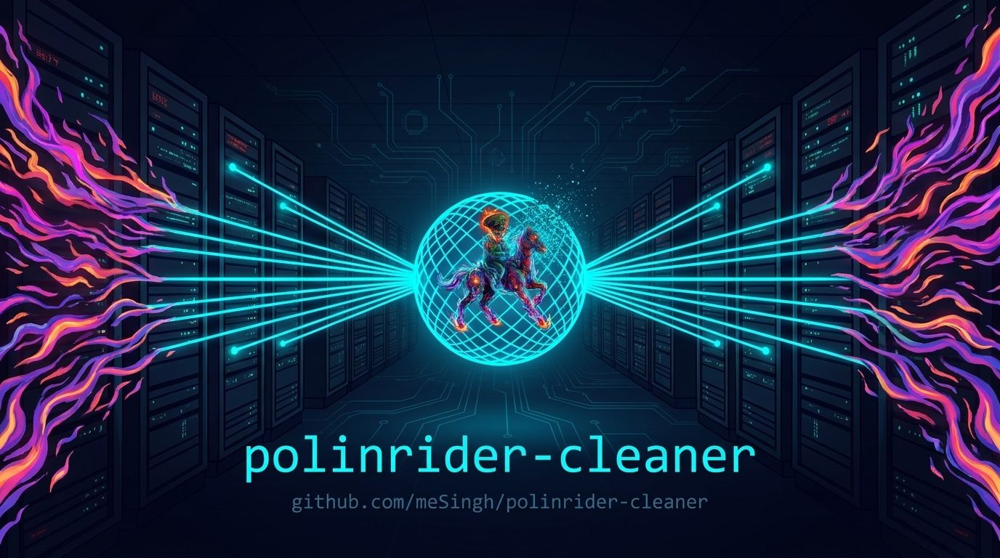

<p align="center">
  
</p>

<h1 align="center">polinrider-cleaner</h1>

<p align="center">
  Detect and clean up after the <strong>PolinRider</strong> supply-chain campaign,
  on a developer machine, in a folder of code, on a GitHub organization or on a
  personal account.
</p>

<p align="center">
  <a href="https://github.com/meSingh/polinrider-cleaner/actions/workflows/ci.yml"></a>
  <a href="https://scorecard.dev/viewer/?uri=github.com/meSingh/polinrider-cleaner"></a>
  <a href="https://github.com/meSingh/polinrider-cleaner/actions/workflows/semgrep.yml"></a>
  <a href="LICENSE"></a>
  
  
  
  <a href="AGENTS.md"></a>
  <br>
  <a href="https://github.com/meSingh/polinrider-cleaner/commits/main"></a>
  <a href="https://github.com/meSingh/polinrider-cleaner/releases/latest"></a>
</p>

<p align="center">
  <sub>One program. Nothing else to install. It changes nothing until you type <code>yes</code>.</sub>
</p>

---

> [!CAUTION]
> **Mid-incident?** Download, verify, run. It asks what you need, one question
> at a time, and tells you what it found in plain words before it offers to
> change anything.

## Run it

1. **Download** the archive for your machine from the
   [latest release](https://github.com/meSingh/polinrider-cleaner/releases/latest):
   macOS (Apple silicon or Intel), Linux (x86_64 or arm64) or Windows (x86_64).
2. **Verify it** before running it. This is a tool for recovering from
   tampered code, so take it at its word about nothing:

   ```bash
   sha256sum -c SHA256SUMS --ignore-missing
   gh attestation verify polinrider-v2.0.0-macos-arm64.tar.gz --repo meSingh/polinrider-cleaner
   ```

3. **Unpack and run it**, with no arguments:

   ```bash
   tar -xzf polinrider-v2.0.0-macos-arm64.tar.gz
   cd polinrider-v2.0.0-macos-arm64
   ./polinrider
   ```

   On macOS the binary is not notarised, so Gatekeeper stops the first run.
   Once you have verified it: `xattr -d com.apple.quarantine ./polinrider`.

Keep the `ioc/` folder beside the binary. That is the indicator set, and the
binary refuses to scan without it.

Homebrew, Scoop and AUR packages for 2.0 follow the release. 1.x, the shell
tool, is still available from
[v1.0.9](https://github.com/meSingh/polinrider-cleaner/releases/tag/v1.0.9).

## What it asks

The first screen asks what to check. Answers are words, never numbers.

| Answer | What it checks |
|---|---|
| `computer` | This machine: your whole home folder, plus login items, scheduled jobs, shell startup files, git and npm settings, running programs and open connections |
| `folder` | One folder of code. It suggests the code folders it finds |
| `organization` | Every repository, branch and tag of a GitHub organization you belong to |
| `account` | The same for your own GitHub account |
| `everything` | This computer first, then GitHub, one after the other |

It shows how far it has come while it works. Then a short summary in plain
words, with `details` for the full list, and one question about what to do.

**It changes something only on a typed `yes`.** `q` leaves. Input that ends
stops the session. Every run saves a full report in your home folder and names
it on the last screen.

On GitHub, for each infected repository it offers what can really fix it:

| Choice | What it does |
|---|---|
| `restore` | Moves each branch back to the newest clean state on GitHub's own push record. Offered only where that record shows one. Never trusts commit dates, which this malware forges |
| `erase` | Rewrites history so the payload is in no commit, then shows how to reset every existing clone |
| `remove` | One new commit that takes the payload out. History is left as it is |
| `archive` | Puts a large infected notice at the top of the README, rewrites the description and makes the repository read-only. Removes nothing |
| `skip` | Leaves it |

Each one shows a dry run of exactly what would change on GitHub before it asks.
`all` applies one fix to every repository that can take it, behind a warning,
and goes ahead only when you type the organization's name.

GitHub checks need [`gh`](https://cli.github.com/) installed and signed in. It
checks that first and tells you what to run if not.

### Without the questions

```bash
polinrider check ~/code            # read-only scan of this machine and that folder
polinrider check --fs-only ~/code  # only the folder, nothing about this machine
polinrider check --apply ~/code    # move confirmed files into quarantine. Never deletes
polinrider clean ~/code/shop       # what it would cut out of an infected build config
polinrider clean --apply ~/code/shop
polinrider --help
```

`clean` strips a payload appended to a build config in place and keeps the
infected original in quarantine. It never touches git: nothing is staged,
committed, reset or stashed.

| Exit code | Meaning |
|---|---|
| `0` | Clean against the current indicator set |
| `1` | Review items only |
| `2` | A confirmed indicator |
| `3` | The scan could not run. Nothing was checked |

A clean result means the current indicators were not found. It is not a
certificate.

---

# The four steps

The tool covers steps 1 and 3. Step 2 is yours, and it is the one that matters
most.

## Step 1. Check the machines

Run `polinrider` and answer `computer` on every machine that has touched the
affected repositories. The verdict is followed by what to do on that machine.

<details>
<summary><strong>Should the machine be rebuilt?</strong></summary>

<br>

Sources disagree, so here is the rule this repository uses.

- **Persistence found**, meaning a login item, systemd unit, Run key, scheduled
  task, git hook, shell profile, an infected editor extension or a copy of the
  implant: **rebuild**. Something is configured to run again.
- **Files in projects only, no persistence, and you can account for what ran**:
  quarantine, delete every local clone, rotate everything, keep scanning weekly.
  A rebuild is still safer if the machine holds production or financial access.

The tool says "rebuild" only when it has found proof that the payload ran on
that machine. Either way, credential rotation is not optional.

</details>

## Step 2. Rotate every credential

Assume everything reachable from the affected user account is in someone else's
hands. Do this from a machine you trust, **before** restoring any branch.

> [!IMPORTANT]
> If a crypto wallet or seed phrase was on that machine, move the funds now.
> This malware targets them specifically.

**First, the ones that grant repository write:**

- Every GitHub personal access token, classic and fine-grained
- Every SSH key **and signing key**
- **Deploy keys on every repository.** Routinely missed: `gh api /repos/OWNER/REPO/keys`
- Authorised OAuth apps and GitHub Apps
- Actions secrets and variables, at org, repo and environment level
- Self-hosted runner registration tokens; rebuild self-hosted runners from image

<details>
<summary><strong>The rest of the rotation list, and clearing cached credentials</strong></summary>

<br>

**Second, publish rights:**

- npm tokens plus 2FA reset. Check `npm token list` for tokens you did not create
- Packagist, PyPI, Go proxy, Docker Hub / GHCR, Chrome Web Store credentials

**Third, everything else the stealer could read:**

- Cloud keys: `~/.aws/credentials`, `~/.config/gcloud`, service account keys
- Every value in every `.env` on the affected machine
- Database, Redis and broker passwords
- Slack, Stripe, Twilio, SendGrid and payment gateway keys
- Vault tokens and kubeconfigs
- Browser-saved passwords, and session cookies via a forced global sign-out

**Cached git credentials survive a password change. Clear them:**

```bash
# macOS
git credential-osxkeychain erase <<< $'protocol=https\nhost=github.com'
# Windows
cmdkey /delete:git:https://github.com
# gh CLI, all platforms
gh auth logout && rm -f ~/.config/gh/hosts.yml
```

</details>

## Step 3. Get the payload out of GitHub

Run `polinrider` and answer `organization` or `account`. It mirrors every
repository into an evidence folder before it changes anything, checks every
branch and tag, and offers the fixes above one repository at a time.

There are two ways the payload reaches a branch, and they need opposite fixes.
If the branch was **force-pushed** to a rewritten history, GitHub's push record
still holds the earlier commit and `restore` goes back to it. If the payload
was **committed normally** on top, there is no earlier state to return to, so
`remove` or `erase` is the fix. The tool works out which one it is looking at
and offers only what applies.

## Step 4. Stop it happening again

### Scan every push

```bash
./ci/install-workflow.sh /path/to/your/repo
```

That vendors a scanner and the indicator set into `.github/polinrider/` in your
repository, so the scan runs from code you control, with no marketplace action
fetched on every push. It commits nothing; review, then commit. In 2.0.0 this
CI scanner is still the shell scanner from 1.x, which also scans every ref of
the history. See [`ci/README.md`](ci/README.md).

<details>
<summary><strong>Organization and machine hardening</strong></summary>

<br>

### GitHub organization

| Control | Why it matters for this specific attack |
|---|---|
| **Require signed commits**, org-wide | The single highest-value control. The propagation script amends and backdates commits; signing makes that immediately visible |
| Block force pushes and restrict deletions on **every** repo, no exceptions | One whitelisted "unimportant" repo is how an org gets in through the side door |
| Require PR review, dismiss stale approvals | Nothing reaches a default branch unseen |
| CODEOWNERS on `.vscode/`, `*.config.*`, `package.json`, lockfiles, `.github/workflows/` | The exact paths this malware writes to |
| Secret scanning and push protection, including a historical scan | Finds secrets the malware may have committed |
| Short-lived fine-grained PATs only; OIDC federation for cloud CI | Removes the long-lived tokens the stealer looks for |

### Developer machine

```jsonc
// VS Code user settings.json
{
  "task.allowAutomaticTasks": "off",           // kills the folderOpen vector outright
  "security.workspace.trust.enabled": true,
  "security.workspace.trust.startupPrompt": "always",
  "terminal.integrated.allowWorkspaceConfiguration": false,
  "extensions.autoUpdate": false,
  "extensions.autoCheckUpdates": false
}
```

```bash
npm config set ignore-scripts true    # then allow per project where a build needs it
```

Pin exact dependency versions, commit lockfiles, use `npm ci --ignore-scripts`
in CI, and proxy your registry if you can.

### Keep scanning

Weekly for a month, then monthly. Reinfection with a rotated signature is
documented behaviour, so a one-off scan is not enough.

</details>

---

# Understand the threat

The [documentation site](https://mesingh.github.io/polinrider-cleaner/) covers
what the campaign is, how it hides and every indicator this tool carries, with
a guide for each kind of cleanup.

---

## Verifying this repository

Do not take a security tool's word for its own integrity. Check it.

```bash
# every commit on main is signed; GitHub shows "Verified" on each one
git log --show-signature -1

# a release archive matches its checksum and its provenance attestation
sha256sum -c SHA256SUMS --ignore-missing
gh attestation verify polinrider-vX.Y.Z-linux-x86_64.tar.gz --repo meSingh/polinrider-cleaner
```

| Signal | What it actually proves |
|---|---|
| [OpenSSF Scorecard](https://scorecard.dev/viewer/?uri=github.com/meSingh/polinrider-cleaner) | 18 automated checks: branch protection, pinned dependencies, token permissions, dangerous workflow patterns, release signing |
| Signed commits | Every commit was made by the key holder. This is the direct counter to the campaign's backdated-amend technique |
| Build provenance on releases | Each binary came from this repository's CI at that tag, unmodified |
| Protected `main` | No force pushes, no deletions, even by the owner |
| Pinned action SHAs | No workflow here can change under you when a third party moves a tag |
| Zero runtime dependencies | The crate depends on nothing, so nothing is fetched to build it or to run it |
| A conformance corpus | Every behaviour is pinned by a case in [`conformance/`](conformance/) that argues for its expected result |

---

## Using this with an AI agent

Point your agent at **[AGENTS.md](AGENTS.md)**. It follows the
[AGENTS.md](https://agents.md/) convention and tells an agent the fixed order of
operations, which commands are read-only, which ones need your explicit
confirmation, and how to read the output without drawing the wrong conclusion.

## Contributing

Issue and pull request templates are in [`.github/`](.github/). False positives
and missed detections are the two most useful things you can report. See
[CONTRIBUTING.md](CONTRIBUTING.md), [HACKING.md](HACKING.md) and
[CODE_OF_CONDUCT.md](CODE_OF_CONDUCT.md).

Security issues in this tool go through [SECURITY.md](SECURITY.md), not a
public issue.

## Disclaimer

This is an **independent open source tool written by one person**. It is not a
product, and it is not affiliated with or endorsed by GitHub, Socket, OpenSSF,
any security vendor, or any employer. The researchers cited in the indicator
reviews are the public source of the indicators; that is a citation, not a
partnership.

It is provided **as is, with no warranty and no liability**. You are responsible
for establishing that you are authorised to scan or modify whatever you point it
at, which matters most if that is an organization account rather than your own.
The GitHub fixes push to GitHub and `--apply` moves files on your machine; both
run with your credentials, at your instruction, and the dry run exists so you
can read the plan first.

Nothing here is legal or compliance advice.

**Read [DISCLAIMER.md](DISCLAIMER.md) before running this against anything you
cannot afford to break.**

---

## Indicator review

This campaign rotates its signatures, so the indicator set is reviewed weekly
against the published sources and every review is written down, including the
weeks that found nothing. Each review keeps its own dated entry, and entries are
never edited or removed:
[`docs/indicator-reviews/`](docs/indicator-reviews/).

**Last reviewed: [5 October 2026](docs/indicator-reviews/2026-10-05.md).**

Eighty-three indicators added after a second analyst team decoded the
campaign's Ethereum dead drop. It exposed two entries that had never matched a
sample: an operator wallet carried in the wrong case and an XOR key carried
truncated. The same report filled in eight C2 servers off the chain and pointed
at the OpenSSF malicious-packages database, which gave fifty-five package names
after five were rejected as substrings of real packages. Also added: the first
fake-font indicator that matches a variant in circulation, a `.llf` file.

The review also names what fixed strings cannot catch: 18 of 35 infected
repositories carry the loader written in Unicode escapes. Read the entry before
trusting a clean result on that family.
